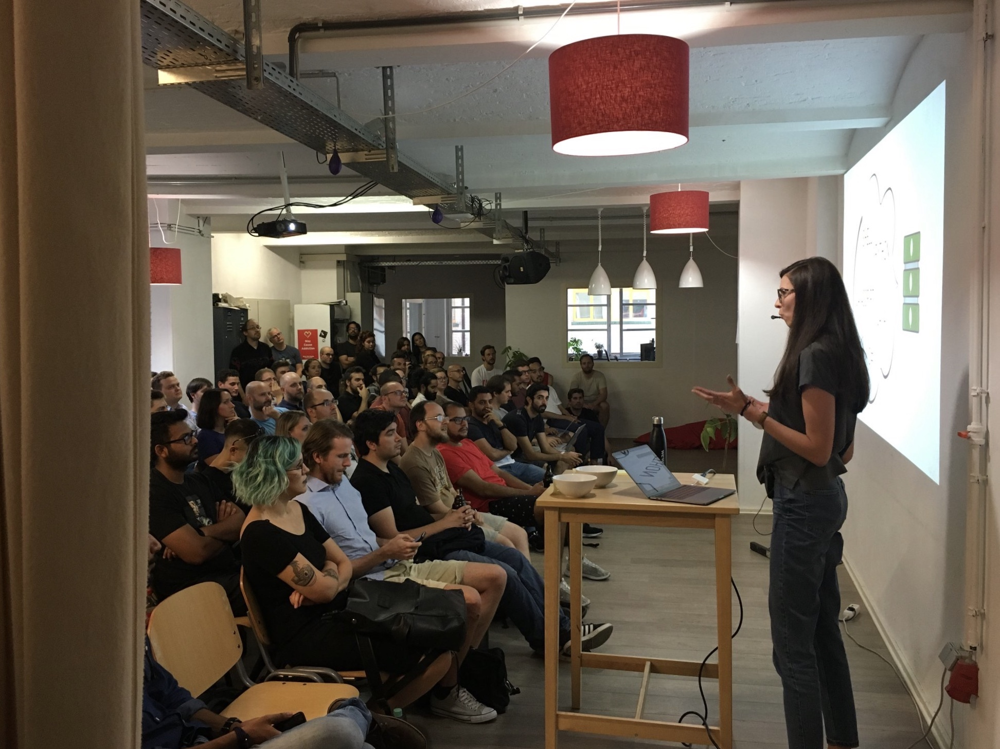

# Compiler in JavaScript using ANTLR

[Berlin.JS](https://berlinjs.org) meetup, 16.08.2018

There are plenty of options, if you need to translate one language to another (e.g. English to German). But what about programming languages? Is it possible to translate JavaScript to Python? Is there any way to customise this process? Where to start?

This talk was about language compilers and basic principles behind it, a bit scientific topic, but very interesting and different from the common routine programming tasks.

Based on my [Compiler in JavaScript using ANTLR](https://medium.com/dailyjs/compiler-in-javascript-using-antlr-9ec53fd2780f) blog post.

The talk wasn't recorded, but check the [pdf with a slide deck](https://speakerdeck.com/alenakhineika/compiler-in-javascript-using-antlr).

